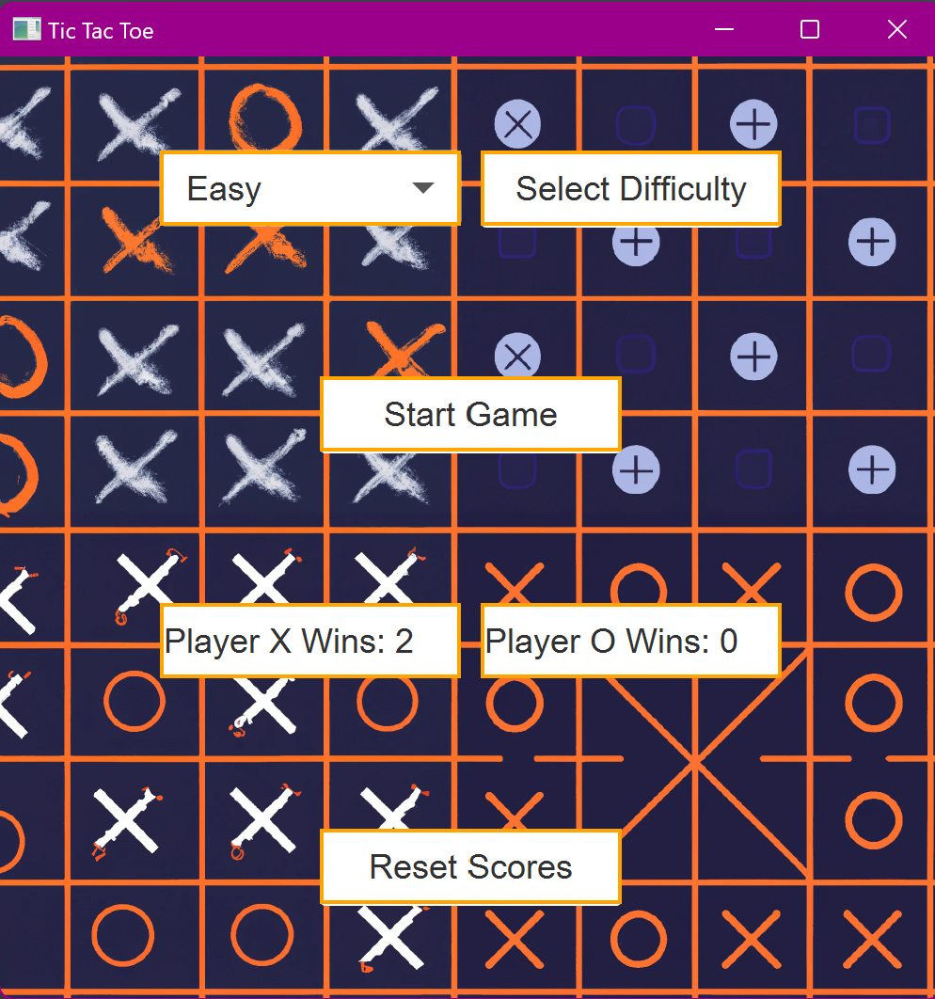
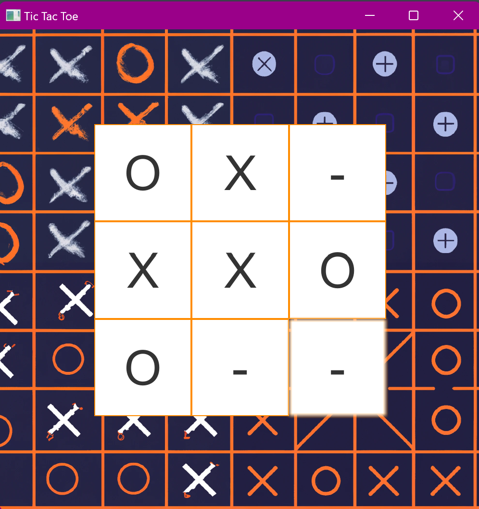
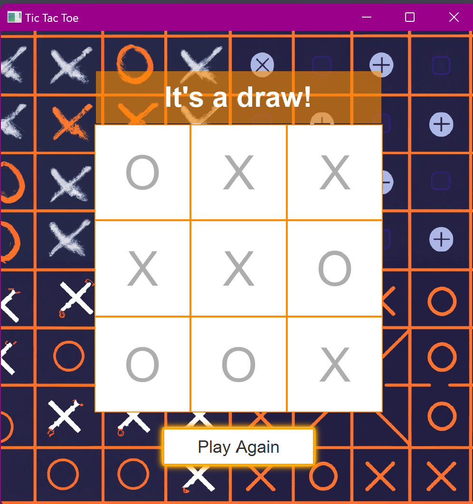

# Tic-Tac-Toe Game

## Table of Contents
- [Description](#description)
- [Features](#features)
- [Requirements](#requirements)
- [Setup](#setup)
- [How to Play](#how-to-play)
- [Game Modes](#game-modes)
- [Screenshots](#screenshots)
- [Contributing](#contributing)
- [License](#license)

## Description
The Tic-Tac-Toe Game is a JavaFX application built using the Kotlin programming language. It implements the classic Tic-Tac-Toe game, allowing a player to play against an AI. It includes a bot player with various difficulty levels.

## Features
- Classic Tic-Tac-Toe gameplay.
- 4 Player vs. Bot modes.
- Three difficulty levels for the bot: Easy, Medium, Hard, and Challenging.
- Welcome screen with game start options and a "Reset Scores" button.
- Win, Draw, and Player Turn messages.
- User-friendly GUI with customizable cell styles.

## Requirements
- Java SE Development Kit (JDK) 17 or higher
- Kotlin 1.7 or higher
- JavaFX 18 or higher

## Setup
1. Clone this repository to your local machine.
   ```
   git clone https://github.com/your-username/tic-tac-toe.git
   ```

2. Make sure you have Java, Kotlin, and JavaFX installed.

3. Open the project in your preferred Kotlin IDE (e.g., IntelliJ IDEA).

4. Build and run the project.

## How to Play
- Launch the game.
- Choose the bot's difficulty level (if playing against the bot).
- Click on cells to make your move.
- The game announces the winner or a draw and allows you to play again.

## Game Modes
- **Player vs. Bot (Easy)**: Play against a bot that makes random moves.
- **Player vs. Bot (Medium)**: Play against a bot that blocks easy wins and tries to win, otherwise makes a random move.
- **Player vs. Bot (Hard)**: Play against a bot that blocks easy wins and makes strategic moves weighing up future placements.
- **Player vs. Bot (Challenging)**: Play against a challenging bot that strives to win or draw every game.

## Screenshots




## Contributing
Contributions are welcome! If you'd like to contribute to this project, please follow these steps:
1. Fork the repository.
2. Create a new branch for your feature or bug fix.
3. Make your changes and test them thoroughly.
4. Submit a pull request with a clear description of your changes.

## License
This project is licensed under the MIT License 

---
